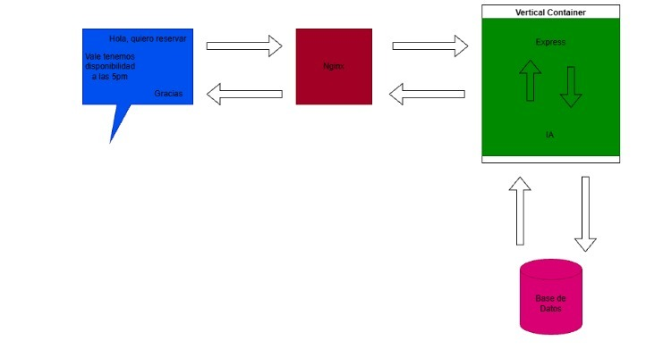

# KYNIC COMPANY

 index
 
 1. *Presentación del negocio*
 
 2. *Github*	

 ## Presentación del negocio
 **Nombre de la empresa:** KYNIC Company

 **Tipo de negocio:** Nuestra empresa de alquiler de  coches 

**Problemas**

En la empresa surgen problemas y dificultades para gestionar las reservas de coches de forma rápida y organizada. Los clientes necesitan consultar qué vehículos están disponibles, elegir la fecha y hora de recogida y establecer durante cuánto tiempo utilizarán el coche. Además, pueden surgir problemas cuando un cliente quiere modificar la fecha u hora de recogida y no se comprueba correctamente la disponibilidad. 
Por ello, la empresa necesita un sistema de reservas con un asistente virtual que permita gestionar las solicitude 

**Cómo funciona**

El cliente  entra a nuestro chat y  habla con el asistente virtual le pregunta: 

 *"¿Cuando desea realizar la reserva del coche  , la fecha y  hora de recogida , por cuanto tiempo lo utilizaran?"*
 
 
 luego le daremos una lista de nuestros coches disponibles.

Después de confirmar la reserva y realizado el pago el cliente:

**Condiciones**

  El cliente  podrá modificar la fecha y hora de recogida del coche  ,según la disponibilidad del coche también se podrá cambiar el coche .

Pasado el día de entrega del coche se cobrará al cliente  una penalización de 30-40.
Cualquier daño se cobrará  en el proceso de entrega.  

Nose puede reservar un coche que ya se haya reservado 

**Ejemplo de como va quedar:**
Carlos 
 29/09/2026
10:00
 
 4 horas
Ford fiesta
 juan@gmail.com

 Tel:600000000

## Github
### *VINCULAR UNA CARPETA DEL PC CON UN REPOSITORIO DE GITHUB*

**Introducción**

GitHub es una plataforma que permite almacenar repositorios de Git en Internet. Y hacerlos comunitariamente invitando a colaboradores/desarrolladores de igual manera las personas pueden ver y descargar los Repositorios que se encuentren públicos.
.En este caso vamos a trabajar con un repositorio de GitHub llamado **"reserva-de-coches"** y vamos a utilizar una conexión mediante SSH.

**SHH**

SSH en GitHub sirve para conectarnos a nuestro repositorio de forma segura sin tener que poner la contraseña cada vez.

**1.Primero creamos una clave SSH** 

En nuestro ordenador creamos una clave y la añadimos a nuestra cuenta de GitHub.
Después podemos clonar, subir y descargar proyectos usando SSH de manera rápida y sencilla.
Así podemos trabajar con nuestros repositorios de GitHub de forma segura y sin complicarnos demasiado. 

(IMAGEN1)
(IMAGEN2)

**2.Crear el archivo README.md**
echo "# reserva-de-coches" >> README.md
Este comando crea un archivo llamado README.md y escribe dentro el texto "# reserva-de-coches".
El archivo README.md se utiliza normalmente para explicar de qué trata un proyecto.
El simbolo >> sirve para añadir texto al archivo. Si el archivo no existe se crea automáticamente.
 (IMAGEN 3)

 **3.Inicializar Git en la carpeta**

git init
Este comando convierte la carpeta actual en un repositorio local de Git.
Al ejecutarlo se crea una carpeta oculta llamada ".git", donde Git guarda la informacion necesaria para controlar las versiones y los cambios del proyecto.

**4.Añadir los archivos al area de preparacion
git add**

Este comando añade todos los archivos de la carpeta al area de preparacion de Git, tambien llamada "staging area".
La staging area sirve para seleccionar los archivos que queremos incluir en el siguiente commit.

**5.Crear un commit**

git commit -m "first commit"

Este comando guarda los cambios que estaban en la staging área.
Un commit es como una version guardada del proyecto.
La opción  permite escribir un mensaje para explicar que cambios hemos realizado.
En este caso el mensaje es "first commit".

**6.Cambiar la rama a main**

git branch -M main

Este comando cambia el nombre de la rama actual a "main".
La rama "main" normalmente se utiliza como rama principal del repositorio.

**7.Vincular el repositorio local con GitHub**

git remote add origin git@github.com:lugokevin026-ai/reserva-de-coches.git
Este comando conecta nuestro repositorio local con el repositorio que tenemos en GitHub.
"origin" es el nombre que se utiliza normalmente para identificar el repositorio remoto principal.
La direccion SSH indica donde se encuentra nuestro repositorio en GitHub.
**8.Subir los archivos a GitHub**

git push -u origin main

Este comando sube los commits de nuestro repositorio local a GitHub.
"origin" indica el repositorio remoto.
"main" indica la rama que queremos subir.
La opcion -u establece esta conexion como predeterminada. De esta forma, en los siguientes cambios podremos utilizar simplemente:
git push

**9.Proceso completo**

Si tenemos una carpeta normal en nuestro PC y queremos subirla al repositorio "reserva-de-coches", primero debemos entrar en la carpeta desde la terminal.

Por ejemplo:
cd "C:\Users\Kevin\Desktop\reserva-de-coches"

Despues ejecutamos los siguientes comandos:
git init

git add .

git commit -m "first commit"

git branch -M main

git remote add origin 

git@github.
com:lugokevin026-ai/reserva-de-coches.git

git push -u origin main

Con estos comandos convertimos la carpeta en un repositorio Git, guardamos los archivos mediante un commit, vinculamos el repositorio local con GitHub y finalmente subimos los archivos al repositorio remoto.

**10:Si el repositorio local ya existe**

Si la carpeta ya tiene Git configurado y ya hemos realizado un commit, no es necesario volver a utilizar git init, git add o git commit.

En ese caso podemos utilizar:

git remote add origin
 git@github.com:lugokevin026-ai/reserva-de-coches.git

git branch -M main

git push -u origin main

Esta es la segunda opcion que muestra GitHub:
"...or push an existing repository from the command line"
Esto significa que estamos trabajando con un repositorio local que ya existe y solamente necesitamos conectarlo con GitHub y subirlo.

Para subir nuevos cambios
Una vez que el repositorio ya esta vinculado con GitHub, cada vez que hagamos cambios en los archivos podemos utilizar:

git add .

git commit -m 
"descripcion del cambio"

git push

git add añade los cambios a la staging area.
git commit guarda los cambios en el repositorio local.
git push sube los cambios a GitHub.
En resumen, el proceso seria:

**CARPETA DEL PC**

git init

git add .

git commit

git branch -M main

git remote add origin

git push

**REPOSITORIO DE GITHUB**
De esta manera la carpeta del PC queda vinculada con el repositorio de GitHub "reserva-de-coches".

